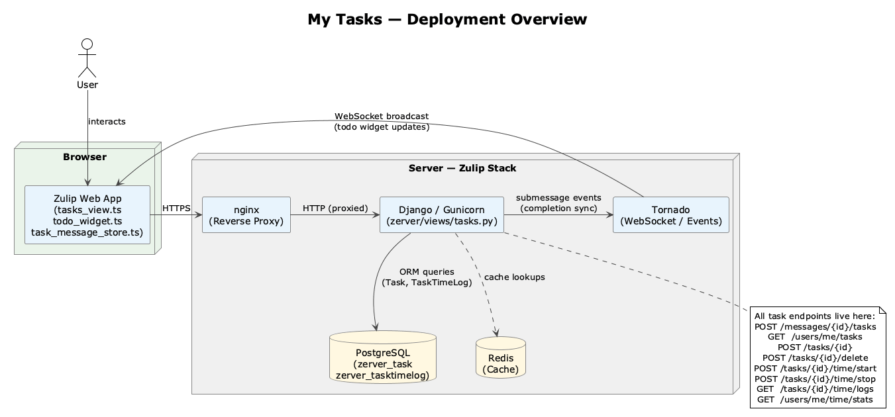
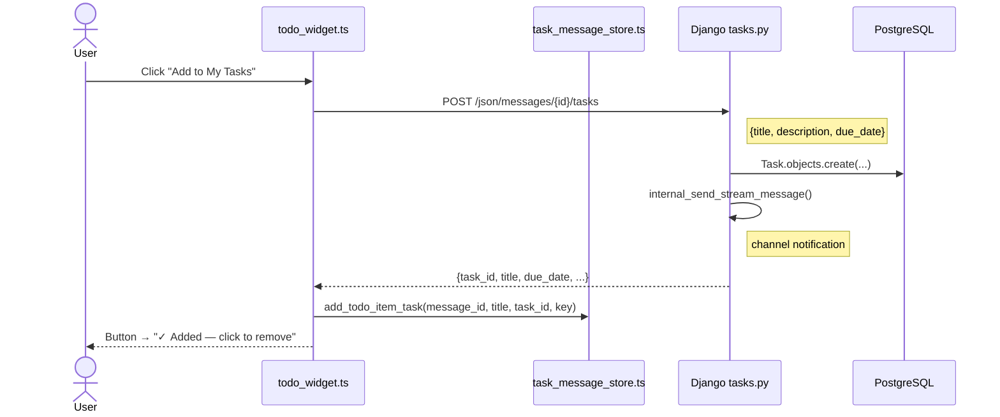
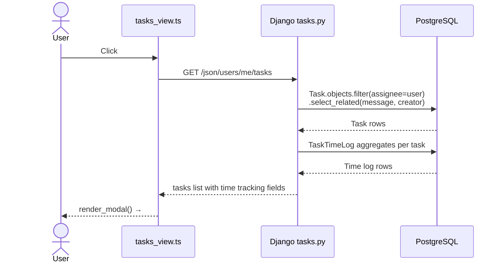
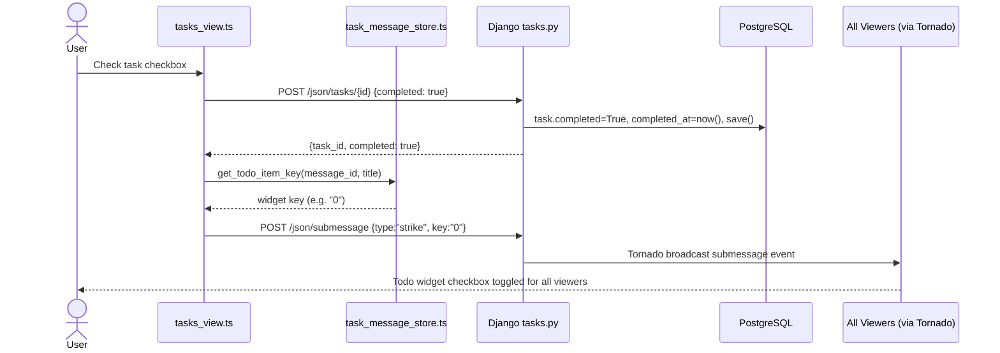
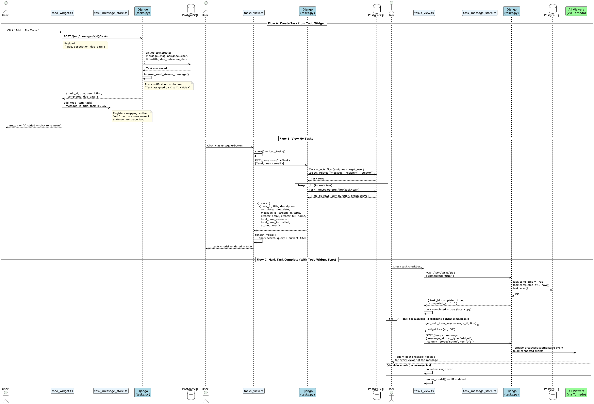
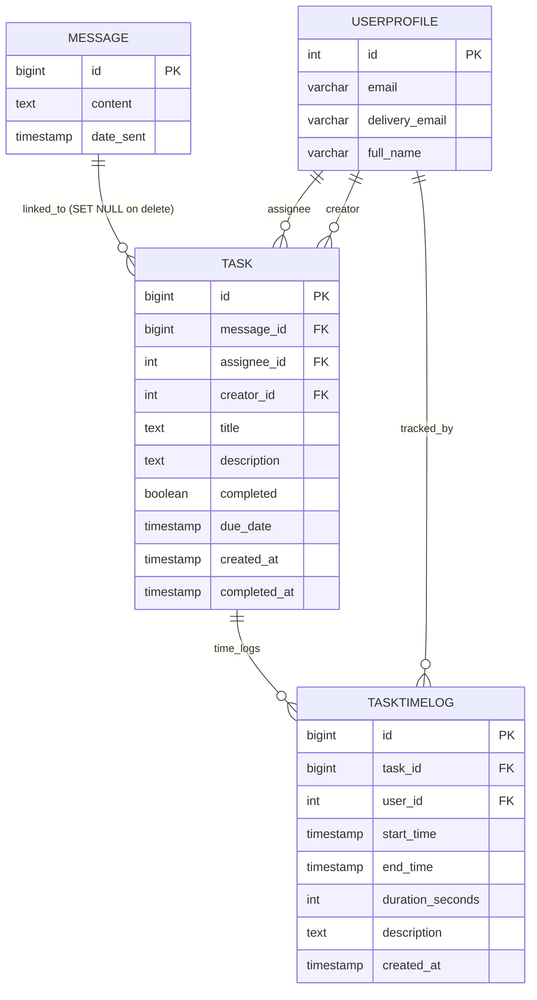
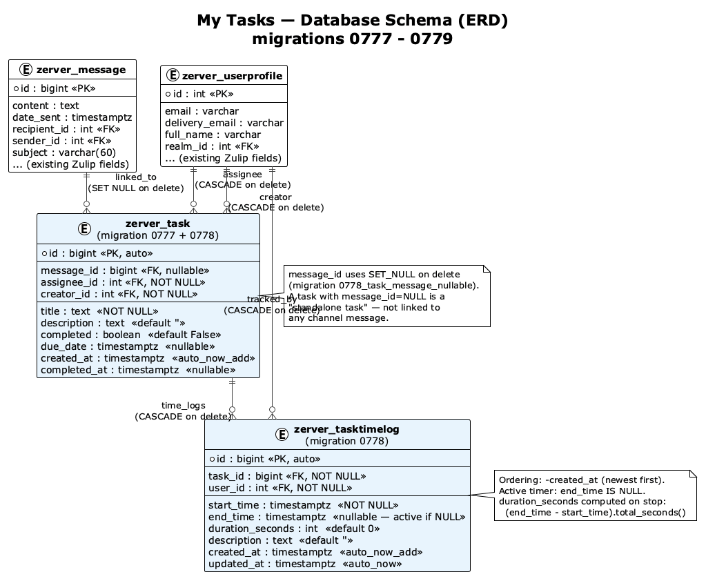

# My Tasks — Architecture

---

## Table of Contents

1. [Deployment Overview](#1-deployment-overview)
2. [Component Overview](#2-component-overview)
3. [Data Flow Diagrams](#3-data-flow-diagrams)
4. [Frontend Component Detail](#4-frontend-component-detail)
5. [Backend Component Detail](#5-backend-component-detail)
6. [Database Schema](#6-database-schema)
7. [Dependencies](#7-dependencies)

---

## 1. Deployment Overview

The My Tasks feature runs entirely within the standard Zulip stack. There are no additional services.

**Development:** Standard `tools/run-dev` setup. SQLite or PostgreSQL database.

**Production (Zulip standard):** Django (gunicorn) behind nginx, PostgreSQL database, Redis for caching, Tornado for the event/WebSocket layer, RabbitMQ for queues.

The My Tasks feature uses:
- Django ORM (PostgreSQL in production)
- Standard Zulip HTTP request/response cycle (no Tornado events for task state)
- Zulip's submessage broadcast mechanism (for syncing todo-widget checkbox state on task completion)



---

## 2. Component Overview

```
Browser
  ├── tasks_view.ts          (My Tasks modal UI — TasksView class)
  ├── task_message_store.ts  (client-side message→task mapping cache)
  ├── todo_widget.ts         (todo widget "Add to My Tasks" buttons)
  ├── user_tasks_assignment.ts (email normalization helper)
  ├── message_delete.ts      (modified: shows error when deletion blocked)
  └── overlays.ts            (modified: nested overlay close guard)

Django (zerver app)
  ├── views/tasks.py         (all task HTTP handlers)
  ├── views/message_edit.py  (modified: task-existence check before delete)
  ├── models/messages.py     (Task, TaskTimeLog models)
  └── migrations/            (0777, 0778×2, 0779)

PostgreSQL
  ├── zerver_task            (Task rows)
  └── zerver_tasktimelog     (TaskTimeLog rows)
```

---

## 3. Data Flow Diagrams

### Flow A: Creating a Task from a Todo Widget

```
User clicks "Add to My Tasks" button
    │
    ▼
todo_widget.ts: create_task_from_todo()
    │  POST /json/messages/<id>/tasks
    ▼
tasks.py: create_task()
    ├── _resolve_assignee() → UserProfile
    ├── Task.objects.create(...)
    ├── (if stream message) internal_send_stream_message() [notification]
    └── return {task_id, title, ...}
    │
    ▼
task_message_store.add_todo_item_task(message_id, title, task_id, key)
    │
    ▼
Button state: "✓ Added — click to remove" (green)
```

### Flow B: Viewing My Tasks

```
User clicks "My Tasks" button (#tasks-toggle-button)
    │
    ▼
tasks_view.initialize() handler fires
tasks_view.show()
    │
    ▼
tasks_view.load_tasks()
    │  GET /json/users/me/tasks
    ▼
tasks.py: list_my_tasks()
    ├── Task.objects.filter(assignee=target_user).select_related(...)
    ├── For each task: fetch TaskTimeLog aggregates
    └── return {tasks: [...]}
    │
    ▼
tasks_view.render_modal()
    └── Destroys & recreates #tasks-modal DOM
        ├── Header (title, Time Stats button, close button)
        ├── Search input
        ├── Filter tabs (All/Pending/Completed)
        └── Task cards (render_task_item per task)
```

### Flow C: Marking a Task Complete (with todo widget sync)

```
User checks task checkbox
    │
    ▼
tasks_view.toggle_task_completion(task_id)
    │  POST /json/tasks/<id>  {completed: true}
    ▼
tasks.py: update_task()
    └── task.completed = True; task.completed_at = now(); task.save()
    │
    ▼ (success callback)
task.completed = true (local copy updated)
    │
    ▼ (if task has message_id)
task_message_store.get_todo_item_key(message_id, title)
    │  POST /json/submessage  {type: "strike", key: "<widget_key>"}
    ▼
Zulip submessage broadcast → all viewers see checkbox toggled in todo widget
```

**Flow A — Create Task from Todo Widget**



**Flow B — View My Tasks**



**Flow C — Mark Task Complete (with Todo Widget Sync)**





---

## 4. Frontend Component Detail

### Module dependency graph

```
tasks_view.ts
  ├── imports: channel (HTTP), blueslip (logging), i18n ($t), task_message_store
  └── exported: TasksView class, tasks_view singleton, initialize()

task_message_store.ts
  ├── imports: channel, blueslip
  └── exported: initialize(), message_has_task(), add_message_task(),
                remove_message_task(), todo_item_has_task(), get_todo_item_task_id(),
                get_todo_item_key(), add_todo_item_task(), remove_todo_item_task()

todo_widget.ts (modified)
  ├── imports: task_message_store, channel, blueslip, people, page_params
  └── calls: create_task_from_todo(), remove_task_from_todo()

user_tasks_assignment.ts
  └── exported: resolve_assignee_email(user)
```

### State management

`TasksView` holds all task state in memory:
- `tasks: Task[]` — the full list from the last API fetch
- `current_filter: "all" | "completed" | "pending"` — selected tab
- `search_query: string` — current search input value

State is not persisted to localStorage. Opening and closing the modal causes a fresh fetch.

`task_message_store` is a module-level singleton (Map objects) initialized once at page load and updated incrementally.

---

## 5. Backend Component Detail

### View handler organization (`zerver/views/tasks.py`)

```
_resolve_assignee()          — shared email→UserProfile helper
create_task()                — POST /messages/<id>/tasks
create_standalone_task()     — POST /tasks
list_my_tasks()              — GET /users/me/tasks
update_task()                — POST /tasks/<id>  (also routes to delete_task if _method=DELETE)
delete_task()                — POST /tasks/<id>/delete
start_time_tracking()        — POST /tasks/<id>/time/start
stop_time_tracking()         — POST /tasks/<id>/time/stop
get_task_time_logs()         — GET /tasks/<id>/time/logs
get_my_time_stats()          — GET /users/me/time/stats
format_duration()            — utility: int seconds → human string
```

### URL routing (`zproject/urls.py:454–464`)

All routes use Zulip's `rest_path()` helper which handles authentication, CSRF, and method dispatch automatically.

---

## 6. Database Schema

### `zerver_task`

```sql
CREATE TABLE zerver_task (
    id            BIGSERIAL PRIMARY KEY,
    message_id    BIGINT REFERENCES zerver_message(id) ON DELETE SET NULL,
    assignee_id   INTEGER NOT NULL REFERENCES zerver_userprofile(id) ON DELETE CASCADE,
    creator_id    INTEGER NOT NULL REFERENCES zerver_userprofile(id) ON DELETE CASCADE,
    title         TEXT NOT NULL,
    description   TEXT NOT NULL DEFAULT '',
    completed     BOOLEAN NOT NULL DEFAULT FALSE,
    due_date      TIMESTAMP WITH TIME ZONE,
    created_at    TIMESTAMP WITH TIME ZONE NOT NULL,
    completed_at  TIMESTAMP WITH TIME ZONE
);
```

### `zerver_tasktimelog`

```sql
CREATE TABLE zerver_tasktimelog (
    id               BIGSERIAL PRIMARY KEY,
    task_id          BIGINT NOT NULL REFERENCES zerver_task(id) ON DELETE CASCADE,
    user_id          INTEGER NOT NULL REFERENCES zerver_userprofile(id) ON DELETE CASCADE,
    start_time       TIMESTAMP WITH TIME ZONE NOT NULL,
    end_time         TIMESTAMP WITH TIME ZONE,
    duration_seconds INTEGER NOT NULL DEFAULT 0,
    description      TEXT NOT NULL DEFAULT '',
    created_at       TIMESTAMP WITH TIME ZONE NOT NULL,
    updated_at       TIMESTAMP WITH TIME ZONE NOT NULL
);
-- Default ordering: -created_at
```





---

## 7. Dependencies

### New dependencies introduced by this feature

None. The feature uses only what is already present in the Zulip stack:

- **Django ORM** — model definitions and queries
- **jQuery / channel.ts** — XHR requests from the frontend
- **Zulip submessage API** — todo-widget checkbox sync
- **Zulip `rest_path` / `typed_endpoint`** — request routing and parameter parsing
- **Zulip `json_success` / `JsonableError`** — response formatting
- **Puppeteer** — E2E testing (already used by Zulip)
- **coverage.py** — backend coverage measurement (already used by Zulip)

### Migration dependency chain

```
0776_realm_default_avatar_source
    └─ 0777_task                        (creates Task table)
        ├─ 0778_task_message_nullable   (message FK → nullable)
        └─ 0778_task_time_log           (creates TaskTimeLog)
            └─ 0779_merge_*             (merges the two 0778 migrations)
```
