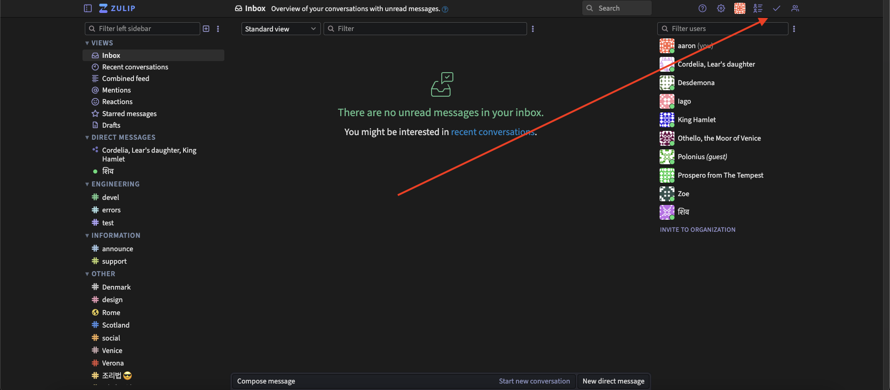
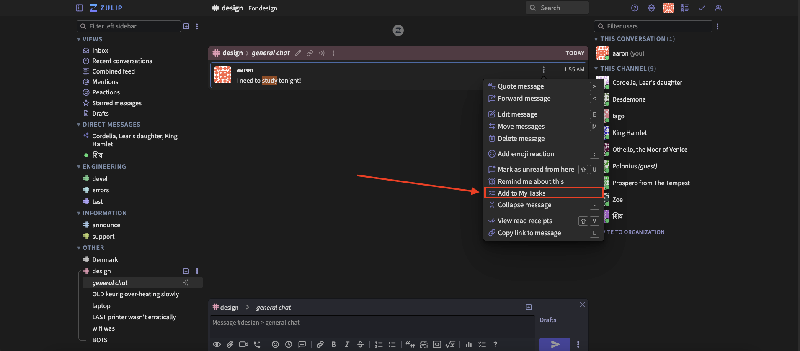
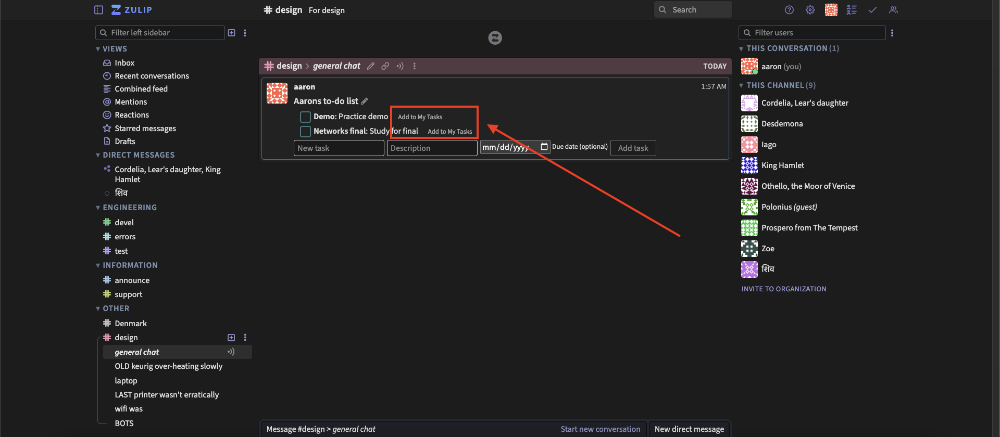
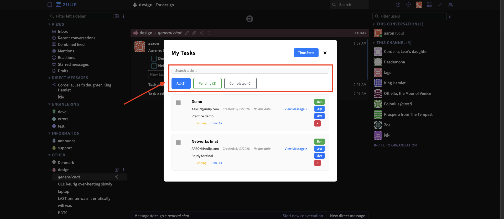

# My Tasks — User Manual

**Audience:** Zulip end users
**Feature version:** as of `main` branch, May 2026

---

## Table of Contents

1. [Opening My Tasks](#1-opening-my-tasks)
2. [Creating a Task from a Channel Message](#2-creating-a-task-from-a-channel-message)
3. [Creating a Task from a Todo Widget](#3-creating-a-task-from-a-todo-widget)
4. [Assigning a Task to Another User](#4-assigning-a-task-to-another-user)
5. [Setting and Interpreting Due Dates](#5-setting-and-interpreting-due-dates)
6. [Searching and Filtering Tasks](#6-searching-and-filtering-tasks)
7. [Marking a Task Complete or Incomplete](#7-marking-a-task-complete-or-incomplete)
8. [Deleting a Task](#8-deleting-a-task)
9. [Navigating Back to the Source Message](#9-navigating-back-to-the-source-message)
10. [Time Tracking](#10-time-tracking)
11. [FAQ](#11-faq)

---

## 1. Opening My Tasks

Click the **My Tasks** button in the left sidebar (labeled "My Tasks" or shown as a task icon).

A modal overlay appears, showing all tasks currently assigned to you.

---

## 2. Creating a Task from a Channel Message

You can convert any channel message into a personal task using the message action menu.

**Steps:**

1. Hover over a message in a channel. The message action icons appear on the right side.
2. Click the **...** (more actions) menu.
3. Select **Add to My Tasks** (or equivalent action label).
4. A form appears where you can edit the task title, add a description, set a due date, and optionally assign it to another user.
5. Click **Save** (or **Add Task**) to create the task.

After creation, a notification is posted to the channel topic confirming the assignment.

> **Note:** If the message is a DM (direct message) rather than a channel message, the task will appear in My Tasks but will not have a stream link (the "View Message" button will not be shown).

---

## 3. Creating a Task from a Todo Widget

When a channel message contains a **Todo List** widget, each item in the list has an **"Add to My Tasks"** button.

**Steps:**

1. Navigate to a message containing a Todo List widget.
2. Find the item you want to track.
3. Click **"Add to My Tasks"** next to that item.
4. The button changes to **"Added — click to remove"** (green checkmark) to confirm success.
5. If the todo item has a due date set, it is automatically copied to the task.

To remove the task created from a todo item, click the button again (it acts as a toggle).

---

## 4. Assigning a Task to Another User

When creating a task (either from a message or via the assignment form), you can assign it to any member of your Zulip organization.

**Steps:**

1. In the task creation form, locate the **Assign To** field.
2. Type the user's email address (either their display email or delivery email — both are accepted, case-insensitively).
3. If left blank, the task is assigned to you by default.

You can also view tasks assigned to a specific user by using the `?assignee=<email>` query parameter on the API (see [Maintainer Manual](maintainer-manual.md#api-endpoints)).

> **Tip:** The assignee field is case-insensitive — `HAMLET@example.com` and `hamlet@example.com` both work.

---

## 5. Setting and Interpreting Due Dates

Due dates are optional. When set, they appear in blue in the My Tasks view.

**How dates are displayed:**

Due dates are shown in your local date format (e.g., `4/25/2025` for US locale). The system avoids timezone conversion errors by reading only the date portion of the ISO timestamp, so the displayed date always matches the date you entered, regardless of your timezone.

**Setting a due date:**

In the task creation or edit form, use the date picker to choose a date. The selected date is stored as midnight UTC internally.

**Reading date display in My Tasks:**

| Display | Meaning |
|---|---|
| `Due: 4/25/2025` (blue text) | Task has a due date |
| `No due date` (grey italic) | No due date was set |

---

## 6. Searching and Filtering Tasks

The My Tasks modal has two ways to narrow down your task list:

### Search Bar

A text input at the top of the modal. Type any text to filter tasks in real time. The search is **case-insensitive** and matches against:

- Task title
- Task description
- Creator email address

The result count shows `Found N of M tasks` while a search is active.

### Filter Tabs

Three tab buttons below the search bar:

| Tab | Shows |
|---|---|
| **All** (default) | Every task assigned to you |
| **Pending** | Tasks not yet marked complete |
| **Completed** | Tasks marked complete |

Search and filter tabs work together — both are applied simultaneously.

---

## 7. Marking a Task Complete or Incomplete

Each task in the list has a checkbox on the left.

- **Check the box** to mark the task complete. The title gains a strikethrough and the task moves to the "Completed" filter.
- **Uncheck the box** to mark an already complete task incomplete again.

When a task that came from a todo widget is marked complete, the corresponding checkbox in the original todo widget is also toggled (the change is synced to all viewers of that message via a submessage event).

---

## 8. Deleting a Task

Each task card has a **red × button** in the top-right corner of the actions column.

**Steps:**

1. Click the **×** button.
2. A confirmation dialog appears: "Are you sure you want to delete this task? This action cannot be undone."
3. Click **Delete** to confirm, or **Cancel** to abort.

> **Important:** You can only delete tasks where you are the **assignee** or the **creator**. Third parties cannot delete tasks.

> **Message Deletion Constraint:** If you created a task from a todo-list message, you cannot delete that source message until you first remove all tasks linked to it from My Tasks. The system will show a popup explaining this if you try.

---

## 9. Navigating Back to the Source Message

For tasks created from a channel message, a **"View Message ↗"** link appears in the task card metadata row, and a **"View"** button appears in the actions column.

Clicking either will:
1. Close the My Tasks modal.
2. Navigate your view to the original channel/topic, scrolled to the specific message.

Tasks created without a message link (standalone tasks) do not show this button.

---

## 10. Time Tracking

Each task has built-in time-tracking controls.

> **Note:** Time tracking requires a database migration to be applied on the server.

### Starting a Timer

Click the green **"Start"** button on the task card. The button changes to yellow **"Stop"** and a **"Timer Active"** badge appears.

### Stopping a Timer

Click the yellow **"Stop"** button. The timer stops and the elapsed time is added to the task's total.

### Viewing Time Logs

Click the blue **"Logs"** button to open a panel showing all recorded time sessions for that task, including:
- Start and end times
- Duration per session
- Whether a session is still active

### Time Statistics Dashboard

In the My Tasks modal header, click **"Time Stats"** to see a productivity dashboard showing:
- Total time tracked across all tasks
- Number of completed vs. active timer sessions
- Time tracked in the last 7 days
- Top 10 tasks by time spent

> **Permission:** Only the task's assignee or creator can start/stop timers and view time logs.

---

## 11. FAQ

**Q: I added a task from a todo widget but the due date is missing.**
A: Ensure the todo widget item had a due date set *before* you clicked "Add to My Tasks". The due date is read at the moment of creation and cannot be retroactively synced.

**Q: I can't delete a channel message that has a todo list.**
A: If you have tasks in My Tasks linked to that message, you must remove those tasks first (click × on each task in My Tasks), then retry deleting the message.

**Q: The "View Message" link doesn't appear on one of my tasks.**
A: That task was created as a standalone task (not linked to a specific message), or it was linked to a DM rather than a channel message. Only channel-message-linked tasks have navigation links.

**Q: I assigned a task to someone else but it still shows in my list.**
A: Tasks appear in the list of the **assignee**, not the creator. If you assigned a task to another person, it will appear in their My Tasks, not yours — unless you assigned it to yourself.

**Q: Time tracking buttons show an error.**
A: The time tracking feature requires a database migration. Ask your Zulip administrator to run `python manage.py migrate zerver 0779_merge_0778_task_message_nullable_0778_task_time_log`.

**Q: Search doesn't find my task.**
A: Search matches title, description, and creator email. It does not search assignee email or due dates. Ensure the task is in the currently selected filter tab (All/Pending/Completed).
